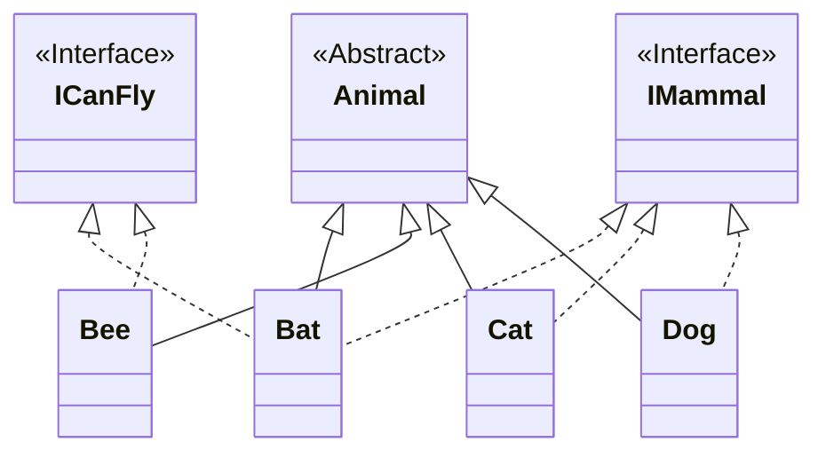

```mermaid
classDiagram
    direction TB
    class Animal{
        <<Abstract>>
    }
    class Bat{
    }
    class Bee{
    }
    class Cat{
    }
    class Dog{
    }

    Animal <|-- Bat
    Animal <|-- Bee
    Animal <|-- Cat
    Animal <|-- Dog

    class IMammal{
        <<Interface>>
    }
    class ICanFly{
        <<Interface>> 
    }

    IMammal <|.. Bat
    IMammal <|.. Cat
    IMammal <|.. Dog

    ICanFly <|.. Bat
    ICanFly <|.. Bee
```